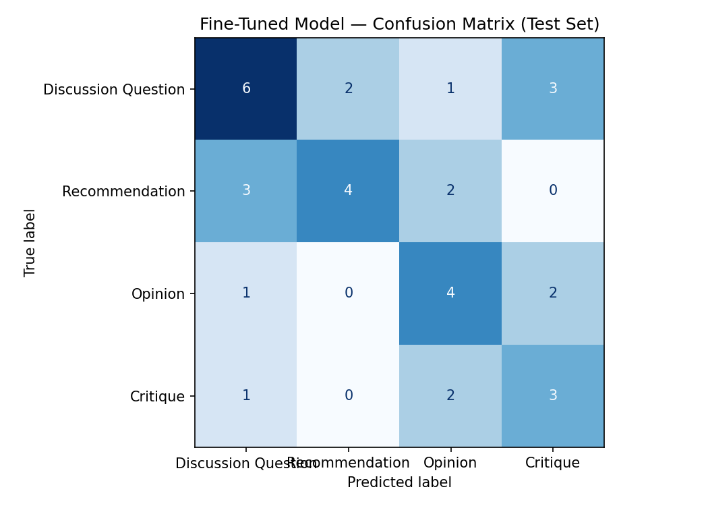

# TakeMeter — Classifying Discourse in r/LetsTalkMusic

A text classifier that sorts posts from [r/LetsTalkMusic](https://www.reddit.com/r/LetsTalkMusic/)
into four types of discourse. The goal is to tell substantive music discussion (critique) apart
from lighter posts (opinions, recommendations, open questions).

## Labels

Full definitions, examples, and edge-case rules are in [planning.md](planning.md).

- **Critique** — makes a claim about music and backs it up with reasoning or specific musical detail (production, lyrics, structure, history).
- **Opinion** — states a preference or judgment from personal taste, without real musical analysis.
- **Recommendation** — points people toward music to listen to, or asks for music to check out.
- **Discussion Question** — asks an open question to get other people's views.

## Data

- **Source:** public posts from r/LetsTalkMusic.  I collected them from [Arctic Shift](https://arctic-shift.photon-reddit.com), a public Reddit archive (`fetch_reddit.py`).
- **Labeling:** I pre-labeled the posts with an LLM using my definitions, then reviewed and corrected every label myself. I also removed duplicate posts so the same post couldn't appear in both training and test.
- **Size:** 222 labeled posts (`labeled_music_posts.csv`; the two-column version used in Colab is `music_posts_colab.csv`).
- **Distribution:** Discussion Question 80, Recommendation 56, Opinion 45, Critique 41. The largest class is 36%, so no label is over 70%.
- **Split:** the Colab notebook splits the data 70/15/15. The test set is 34 posts.

## Model and training

- **Base model:** `distilbert-base-uncased`.
- **Platform:** Google Colab (T4 GPU).
- **Training decision:** the default settings (3 epochs, learning rate 2e-5) produced a broken model that predicted Discussion Question for 33 of 34 test posts (accuracy 0.382, below the baseline). I raised training to **10 epochs** and **learning rate 5e-5**. That stopped the collapse and accuracy went up to 0.50. Batch size stayed at 16.

## Baseline

The baseline is a zero-shot prompt to **Llama-3.3-70B** on Groq. I gave it the four label
definitions with one example each and told it to reply with only the label name. I ran every test
post through it and compared its predictions against the true labels, using the same test set as
the fine-tuned model.

# Evaluation Report

## Accuracy

| Model | Test accuracy |
|---|---|
| Baseline (Llama-3.3-70B, zero-shot) | 0.706 |
| Fine-tuned DistilBERT (3 epochs, lr 2e-5) | 0.382 |
| Fine-tuned DistilBERT (10 epochs, lr 5e-5) | 0.500 |

## Per-class metrics

Baseline:

| Label | Precision | Recall | F1 | Support |
|---|---|---|---|---|
| Discussion Question | 0.65 | 0.92 | 0.76 | 12 |
| Recommendation | 1.00 | 0.56 | 0.71 | 9 |
| Opinion | 0.80 | 0.57 | 0.67 | 7 |
| Critique | 0.57 | 0.67 | 0.62 | 6 |
| Macro avg | 0.75 | 0.68 | 0.69 | 34 |

Fine-tuned (10 epochs, lr 5e-5):

| Label | Precision | Recall | F1 | Support |
|---|---|---|---|---|
| Discussion Question | 0.55 | 0.50 | 0.52 | 12 |
| Recommendation | 0.67 | 0.44 | 0.53 | 9 |
| Opinion | 0.44 | 0.57 | 0.50 | 7 |
| Critique | 0.38 | 0.50 | 0.43 | 6 |
| Macro avg | 0.51 | 0.50 | 0.49 | 34 |

## Confusion matrix (fine-tuned)

Rows = true label, columns = predicted label.

| True \ Predicted | Discussion Question | Recommendation | Opinion | Critique |
|---|---|---|---|---|
| Discussion Question | 6 | 2 | 1 | 3 |
| Recommendation | 3 | 4 | 2 | 0 |
| Opinion | 1 | 0 | 4 | 2 |
| Critique | 1 | 0 | 2 | 3 |

The diagonal (6 + 4 + 4 + 3 = 17 of 34) is correct. The image version is `confusion_matrix.png`.

## What the first run looked like

The first fine-tuning run used the default 3 epochs and learning rate 2e-5. It collapsed to one
class, predicting Discussion Question for almost every post (accuracy 0.382, below the baseline).
After raising it to 10 epochs and lr 5e-5, the model started predicting all four classes and
accuracy rose to 0.50.

## Where the model goes wrong

Looking at all the errors, three patterns stand out:

1. **Recommendation is the hardest class (recall 0.44).** 5 of 9 Recommendations were missed, mostly read as Discussion Question. A post asking for music to check out and a post opening a discussion look almost the same on the surface.
2. **Opinion and Critique get confused both ways.** A hot take with a bit of reasoning looks like Critique, and a critique that opens with a blunt judgment looks like Opinion.
3. **Posts that end with a question get pulled toward Discussion Question or Critique based on their wording**, even when the post's real purpose is something else.

I also checked whether short posts were misclassified more often, but they weren't — the errors
group by label boundary, not by length. I labeled these boundary cases consistently and removed
duplicates, so the problem is the boundaries themselves plus having only about 40 examples per
class, not inconsistent labeling.

## Three wrong predictions

**1. True Recommendation, predicted Discussion Question (confidence 0.36)**
> "Looking to dive deeper into 80s albums. I realized that even though I love 80s music, I mostly know the big radio hits rather than full albums... [what would you recommend]"

The post wants album recommendations, but it starts by sharing the author's taste and is phrased
as an open ask, which looks like a discussion prompt. The confidence was only 0.36, so the model
was genuinely unsure. This is the main weakness: a request for recommendations and a discussion
question look nearly identical.

**2. True Opinion, predicted Critique (confidence 0.73)**
> "Thoughts on why certain Bowie albums resonate with me more than the usual canon choices..."

I labeled this Opinion because it is about personal taste ("resonate with me"), not a defended
argument. The model predicted Critique with high confidence because the analytical framing (a
full-discography listener, album comparisons) is the kind of language that usually signals
Critique. It keys on the vocabulary, not on whether a claim is actually argued.

**3. True Critique, predicted Discussion Question (confidence 0.71)**
> "Listening to every Rush studio album in release order made me think about the band's evolution... [did your appreciation shift?]"

This is a real critique (a reflection after listening to the whole catalog), but it ends with a
question to the community, and the model used that question to predict Discussion Question. It
shows the model pays attention to the form of the post (a closing question) over its purpose.

The last two are the exact edge cases I predicted would be hard in planning.md before training.

## Sample classifications

| Post (truncated) | True | Predicted | Confidence |
|---|---|---|---|
| "Looking to dive deeper into 80s albums…" | Recommendation | Discussion Question | 0.36 |
| "Thoughts on why certain Bowie albums resonate with me…" | Opinion | Critique | 0.73 |
| "Listening to every Rush studio album in release order…" | Critique | Discussion Question | 0.71 |
| "Not liking classical music does not make you less intelligent…" | Opinion | Discussion Question | 0.80 |

## Reflection: what the model captured vs. what I intended

I designed the labels around **intent** — what a post is trying to do. The model instead learned
**surface wording** as a stand-in for intent. They agree often enough to reach 0.50 accuracy, but
the model breaks exactly where wording and intent disagree:

- It overfit to keywords. Music-analysis words ("production", "discography", "evolution") push a post toward Critique even when the post is just an opinion or a question.
- It misses the actual goal. It can't tell a defended claim (Critique) from a bare judgment (Opinion), or a recommendation phrased as a question from a real discussion question, because those differences live in the post's structure, not in any single word.

So I built a classifier of intent but got a classifier of the vocabulary that goes with intent.
Fixing it would need more examples of the cases where wording and intent disagree (questions that
are really recommendations, opinions dressed up with analysis), not just more data overall.

## Spec reflection

- **How the spec helped:** requiring a baseline before fine-tuning was the most useful step. Without the 0.706 baseline, my first fine-tuned result (0.382) might have looked like a working model with a low score. Against the baseline it was clearly a regression, which is what pushed me to find and fix the majority-class collapse.
- **How I diverged:** the spec assumed manual collection and warned against turning collection into a coding project. Reddit was blocked on my machine, so I had to script the collection through Arctic Shift instead. I kept the intent of the rule by reviewing every label by hand rather than trusting the automation.

## AI usage

1. **Pre-labeling (disclosed).** I gave an LLM my label definitions and had it suggest a label for every collected post. I then went through all of them myself and corrected the ones I disagreed with, focusing on the borderline cases. The dataset keeps both the AI's suggestion and my final label, and no label was used without my review.
2. **Baseline prompt and debugging.** I had an LLM help draft the baseline classification prompt from my definitions. When the baseline returned every response as unparseable, I asked it to diagnose; it found a case-sensitivity bug in the matching code (lowercased model output compared to capitalized labels) rather than a prompt problem, and I applied the one-line fix.

What I overrode: I changed several pre-labels during review, set my own success thresholds in
planning.md, and made the final call on every ambiguous Critique vs. Opinion case.

# Demo Recording
This is the link to Loom video https://www.loom.com/share/4159a4742f4145f9b45c3a73f40c6e08 
 
# Google Colab Link
This is the colab notebook link https://colab.research.google.com/drive/1CJwyIKFF6fWVodqFoc1nHss_U0rWSJZF?usp=sharing